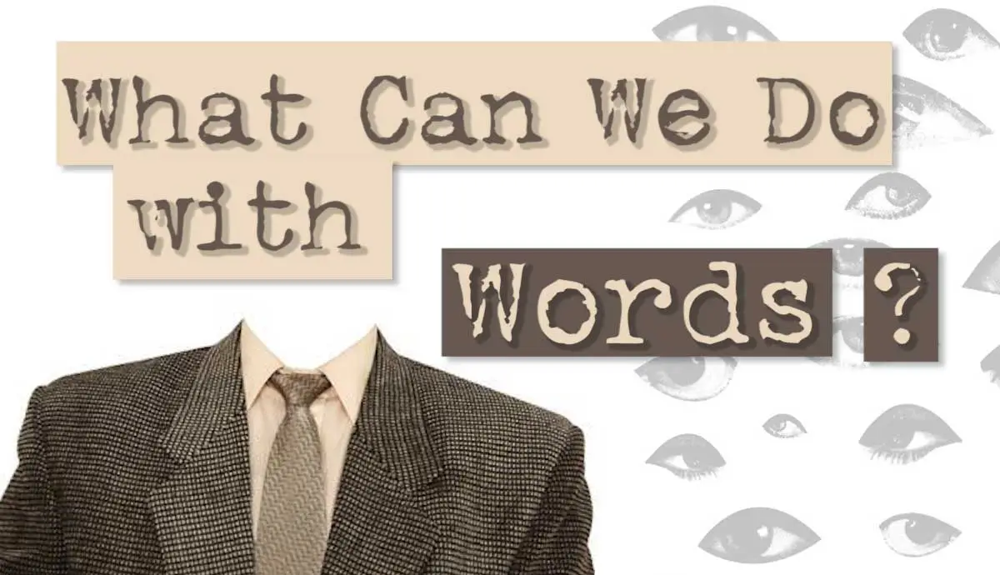

# MORPHOLOGY 

### 3.1 Introduction
 In the introduction of the third chapter, the authors focus on the common phenomenon of people absorbing the knowledge of words in a language, yet never questioning how they came to be or how they are constructed. The structure of words and its particular elements, ways of analysing said structure, rules regarding the creation of new words – this is only a portion of what morphology pertains to. Invented by Wolfgang von Goethe for biological purposes, the term _‘morphology’_ emerged as a linguistic branch in the nineteenth century.
 ### 3.2 Morphemes
 
 In subchapter 3.2, the authors differentiate between a **morphological** and **phonological** structure. On the example of the word _“dreamless_,_”_ they prove that in morphology each element of the word has its own meaning, whereas in phonology, the different phonemes have no distinct meaning. Thus, morphology focuses more on the meanings of individual morphemes – the smallest meaningful units of a word. Importantly, to be considered a word, a unit must be a morpheme, otherwise it has nothing to do with morphology. 
 
 The authors then distinguish between two types of words: **monomorphemic/simplex words** and **polymorphemic/complex words**. The former group consists of only one morpheme, whereas the latter – more than one morpheme. Another group of morphemes called unique morphemes pertains to words such as _‘cranberry_,_’_ in which the morpheme _‘cran’_ is still considered a morpheme, though it does not carry meaning on its own. The authors then move on to **_the conflict_** between etymology and morphology, underlining that these branches ought not to be confused with one another. Moreover, they introduce a new term regarding the form of a word – **morph**. An important process in morphology is the vowel alternation, in which the plural form of a word is expressed by changing the vowel. When a word does not undergo vowel alternation or has no visible form expressing plurality, it is called a zero morph.
 ### 3.3 Types of morphemes
In subchapter 3.3, the authors highlight the difference between **free morphemes**, which can stand on their own, as well as **bound morphemes**, which need another element to exist as a part of a word. 

Importantly, the morpheme responsible for providing a basis for other morphemes are called **bases**. Words derived from a base are called **derivatives**, e.g. _‘agree’_ and _‘disagreement_._’_ Bases consisting of two morphemes are complex words, whilst bases consisting of one morpheme – the core element – are deemed roots. The authors then underline the notion of an **affix**, a morpheme attached to bases, and its two groups: **_prefixes_**, appearing at the beginning of a word, and **_suffixes_**, in the end. A less popular type of an affix is an **_infix_**, which is implemented into the base.
### 3.4 Morphological analysis
In subchapter 3.4, the authors focus on the morphological analysis of words, which can be expressed through a **tree diagram**. 

In order to illustrate a correct diagram, it is significant to draw attention not only to the types of morphemes we are dealing with, but also to the order in which they attach to the base. What is more, helpful in establishing such a diagram is the meaning that the units carry, e.g. _‘unfear’_ versus _‘fearful_._’_ The first word carries no meaning, therefore such order makes no sense when drawing a tree diagram for the word _‘unfearful_._’_ According to the authors, it is also important to note what affixes attach to different word-classes.
### 3.5 Allomorphs
In subchapter 3.5, the authors underline the fact that the meaning behind morphemes may be expressed through more than one physical form, e.g. indefinite articles. Such case portrays the notion of an [**allomorph**](https://www.britannica.com/topic/allomorph), in which instance the same morpheme can be realized by the utilization of different morphs. The distribution of allomorphs differs due to phonological conditioning and is mostly predictable.

The authors distinguish between two more types of conditioning: **lexical** and **morphological**. When it comes to realisations of morphemes, they can be either regular or irregular e.g. the former is the case of plural _-s_, whereas the latter illustrates the expression of plurality in a different way.
### 3.6 Inflection and derivation  
In subchapter 3.6, the authors introduce the notion of a **lexeme**, which is an abstract unit representing a constant meaning for different forms of a word. On the other hand, we have grammatical words, which are said different forms of a lexeme, e.g. _‘bake’_ and _‘bakes.’_ Affixes, such as _-s_ or _-ed_, which specifically encode grammatical information, are called **inflectional**. On the contrary, affixes, such as _-er_ in word _‘baker_,_’_ creates a new lexeme and is called **derivational**. Inflection includes the plural, past tense, as well as the possessive and progressive forms. The authors conclude that, in English:
* inflectional affixes are suffixes, whereas derivational affixes are expressed both through the utilization of suffixes and prefixes.
* derivational affixes carry different meanings that inflectional ones, where the meaning is consistent.
* derivation is restricted by the word-class, whereas inflection is utilized in majority of said classes. 

Significantly, when an affix is able to change the word-class of a base, it is a derivational one – an inflectional affix does not hold the power to implement such a change.

### Chapter 3.7: Word-formation
<<<<<<< HEAD
This chapter explores how new words are created in English through several key processes.

### 3.7.1 What is Word-formation?
Word-formation refers to the processes by which new words are created in a language. This involves various methods, including the addition of affixes, the combination of words, and changes in word class without morphological change.

### 3.7.2 Affixation
=======

This chapter explores how new words are created in English through several key processes.

### 3.7.1 What is Word-formation?

Word-formation refers to the processes by which new words are created in a language. This involves various methods, including the addition of affixes, the combination of words, and changes in word class without morphological change.

### 3.7.2 Affixation

>>>>>>> 94c48895d583d9c37daed454884b72de2a3cb16a
Affixation is a common word-formation process where prefixes or suffixes are added to base forms (roots) to create new words. The chapter details:

**Prefixes:** Added to the beginning of a word (e.g., "un-" in "unhappy").
**Suffixes:** Added to the end of a word (e.g., "-ness" in "happiness").
The impact of affixation on the meaning and grammatical category of the base word.

### 3.7.3 Compounding
<<<<<<< HEAD
Compounding involves combining two or more words to create a new word with a specific meaning. The chapter explains:

Types of compounds: Such as noun-noun compounds (e.g., "toothpaste"), adjective-noun compounds (e.g., "blackboard"), and verb-noun compounds (e.g., "pickpocket").
=======

Compounding involves combining two or more words to create a new word with a specific meaning. The chapter explains:

**Types of compounds:** Such as noun-noun compounds (e.g., "toothpaste"), adjective-noun compounds (e.g., "blackboard"), and verb-noun compounds (e.g., "pickpocket").
>>>>>>> 94c48895d583d9c37daed454884b72de2a3cb16a
The structure and stress patterns of compounds in English.
How compounds differ from phrases in terms of meaning and pronunciation.

### 3.7.4 Conversion
<<<<<<< HEAD
=======

>>>>>>> 94c48895d583d9c37daed454884b72de2a3cb16a
Conversion, or zero derivation, changes the word class of an existing word without any morphological change. Examples include:

**Noun to verb:** "to butter" (from the noun "butter").
**Verb to noun:** "a run" (from the verb "to run").
This process is frequent in English and contributes significantly to its lexicon.

### 3.7.5 Shortening
<<<<<<< HEAD
=======

>>>>>>> 94c48895d583d9c37daed454884b72de2a3cb16a
Shortening includes processes like clipping and acronyms, where parts of words are omitted to form new terms. The chapter covers:

**Clipping:** Shortening longer words (e.g., "advertisement" to "ad").
**Acronyms and initialisms:** Formed from the initial letters of a phrase (e.g., "NASA" for National Aeronautics and Space Administration).

### Chapter 3.8: Conclusion
<<<<<<< HEAD
=======

>>>>>>> 94c48895d583d9c37daed454884b72de2a3cb16a
The conclusion of Chapter 3 summarizes the importance of understanding word-formation processes in linguistic analysis. It emphasizes how these processes contribute to the dynamic and evolving nature of the English lexicon, reflecting both linguistic creativity and the adaptability of the language to new concepts and technologies.

# PRAGMATICS

# Studying Language in Use: Pragmatics

## 6.1 Introduction
- Previous chapters discussed language structure.
- Question raised: What do speakers use language for and how do they use it?
- Speakers have intentions: stating, promising, declaring, requesting.
- Listeners interpret these intentions.
- Pragmatics studies these communicative intentions and how they are conveyed and understood.

## 6.2 Expressing Intentions Through Language

### 6.2.1 Using Language to Act: Speech Acts
- Language is used to perform actions (e.g., commanding, stating, promising).
- John L. Austin's Speech Act Theory: linguistic actions in context are called speech acts.
- Example analysis: "I’ll phone you tomorrow" (promising), "I baptise thee Alexander Frederic" (baptizing).
- Incomplete sentences (e.g., "Well, I mean there was a…") do not perform clear actions.

### 6.2.2 Speech Acts: A Closer Look
- Example: "What a delicious pie!" expresses a compliment.
- Speech acts consist of:
  - **Locution**: linguistic form.
  - **Illocution**: communicative intention.
  - **Perlocution**: effect on the hearer.
- Utterance vs. Sentence: utterances are realizations of communicative intentions, may not always be complete sentences.

### 6.2.3 Classifying Speech Acts
- Different intentions (e.g., promising, commanding) create diverse speech acts.
- John Searle’s classification of speech acts:
  - **Declarations**: change the state of affairs (e.g., "You are fired.").
  - **Representatives/Assertives**: state what the speaker believes (e.g., "Our team has won the competition.").
  - **Expressives**: express feelings (e.g., "I apologise for this awful mess.").
  - **Directives**: make the hearer do something (e.g., "Be quiet, Jaye.").
  - **Commissives**: commit the speaker to an action (e.g., "I’ll bring you a map of London.").
- Classification can be complex due to context and multiple intentions (e.g., threats as both commissive and directive).

### 6.2.4 Realisations of Speech Acts: Direct and Indirect Speech Acts
- Illocutions can be direct (e.g., "I advise you to see a doctor.") or indirect (e.g., "Why don’t you see a doctor?").
- Direct speech acts: straightforward relation between form and function.
- Indirect speech acts: mismatch between form and function.
- Indirect speech acts are often used for politeness.
- Effectiveness of speech acts depends on context and clarity of the intended message.

## Conclusion
- Pragmatics involves understanding how language is used to express intentions.
- Speech acts are key to this understanding, with diverse types and forms.
- Context is crucial in interpreting and classifying speech acts.

### 6.2.5 Performing Speech Acts Successfully: felicity conditions

Now let's at new examples to understand felicitty conditions!

(13) 
a. If you move, I’ll call the police. (addressed to somebody who does not understand English)
b. If you don’t pay me, I resigned. (addressed to your boss)
c. If you spill the milk all over you, I will buy you an ice-cream. (a mother to her child who really likes ice-cream)
d. If you leave the bathroom in this awful state again, I will kill you. (a wife to her husband)

In the examples provided, the speakers intend to convey threats as their speech acts. However, each example presents challenges to the success of the threats due to various factors.

In (13a), the threat is ineffective because the hearer doesn’t understand English, rendering the illocutionary force incomprehensible. This highlights the importance of the general condition: the necessity for the hearer to understand the locution.

(13b) fails as a threat because it refers to a past action (“I resigned”), which cannot effectively threaten future consequences. This illustrates the propositional content condition: the requirement for the speech act to convey its intended meaning clearly and properly.

In (13c), although the threat is about a future action and properly conveyed, it fails because the consequence mentioned (buying ice-cream) is something pleasant for the child. This reveals that for a threat to be successful, the future action must be unpleasant for the hearer.

Regarding (13d), the threat lacks sincerity because it’s highly unlikely that the wife genuinely intends to kill her husband over a minor issue. This demonstrates the importance of sincerity condition: the necessity for the speaker to earnestly intend to carry out the speech act.

Additionally, there’s an essential condition for successful speech acts: both the speaker and the hearer must regard the utterance as the realization of the intended speech act. This essential condition ensures mutual recognition and understanding between the interlocutors.

Overall, felicity conditions, including the general condition, propositional content condition, sincerity condition, and essential condition, play crucial roles in determining the success of speech acts. Misunderstandings often arise when these conditions are not adequately met, highlighting the importance of context and mutual comprehension in communication.
### 6.3  Understanding Utterance Meaning
Understanding utterances involves intricate processes that occur rapidly, often without conscious awareness. Imagine entering a coffee shop with a friend who’s aware of your nut allergy. They point out a cake, saying, “That cake over there contains nuts.” 

To grasp the meaning, you first decipher the semantic content, then infer the pragmatic meaning. This inferencing process relies on various types of knowledge, including situational, interpersonal, and world knowledge. For instance, understanding which cake is meant requires situational context, while knowing about your allergy and the dangers of nuts stems from interpersonal and world knowledge, respectively. Drawing the inference that your friend warns you not to eat the cake integrates these types of knowledge. However, context can alter inferences; if you adore nuts, you might infer that your friend recommends the cake. Furthermore, co-textual knowledge—understanding the preceding conversation—plays a role. In another scenario, if you express a desire for a cake and your friend responds with “But it contains nuts,” co-textual understanding clarifies that “it” refers to the cake mentioned earlier. 

## 6.4 Exploring Pragmatic Principles
### 6.4.1 The Cooperative Principle
Now let us explore a new scenario. 

**A: Hello, how are you?**
B: Oh, my legs are aching and I have a pain in my arm, and actu- ally, on top of all this, my cat ran away in the morning, and my neighbour played the guitar till late in the evening. Besides, my sister fell ill and wants me to drive her to the doctor.
**A: Do you know at what time the meeting starts?**
B: What a wonderful day we have!
**A: Hhm, dear, what did you do yestarday?**
B: Oh, I went to bed, then danced a lot, first I has supper and visited my friend.
**A: When, then, did you manage to get enough sleep?**
B (**lying**): Absolutely. 

In the dialogue provided, speaker B’s responses deviate from what’s typically expected in a conversation, making it difficult for speaker A to draw proper inferences. Speaker B’s lengthy, irrelevant, ambiguous, and deceptive replies hinder effective communication. However, these deviations can be analyzed through Grice’s Cooperative Principle and its associated maxims.

In the first exchange, speaker B’s response is excessively detailed and unrelated to the greeting, violating the maxim of quantity and clarity. The subsequent exchanges similarly flout various maxims—relevance, clarity, and honesty—resulting in confusion and frustration for speaker A.

Yet, not all departures from the maxims lead to breakdowns in communication. In some cases, speakers flout the maxims intentionally, relying on implicature to convey meaning indirectly. For instance, when speaker B responds to the question about the meeting time with “What a wonderful day we have!” it seems irrelevant at first. However, this response indirectly implies that speaker B doesn’t know the meeting time, prompting speaker A to infer this implicature from the context.

In another example, when speaker B responds to the question about yesterday’s activities with a seemingly unordered list of events, she’s flouting the maxim of clarity. However, speaker A, aware of the context and their relationship, is able to decipher the implied message despite the lack of clarity.

The concept of flouting illustrates that communication isn’t always straightforward; speakers sometimes deviate from linguistic norms for various reasons, such as politeness or maintaining social harmony. These deviations highlight the nuanced nature of human interaction and the multifaceted principles guiding it beyond mere adherence to the Cooperative Principle.

### 6.4.2 Politeness
The concept of *politeness* in linguistic terms goes beyond our intuitive understanding of polite or impolite behavior. It involves maintaining positive and negative face, which are parts of individuals’ social self-image. Positive face refers to the desire to be admired, loved, and accepted by others, while negative face pertains to the desire not to be intruded upon or disturbed in privacy.

When speakers communicate, they often aim to minimize threats to the hearer’s face. Positive politeness involves strategies that enhance the hearer’s positive face, such as expressing solidarity or using indirect speech acts to avoid direct criticism. Negative politeness, on the other hand, involves strategies to minimize threats to the hearer’s negative face, such as using mitigating devices or making requests indirectly to respect the hearer’s freedom of choice.

The degree of politeness employed in communication can vary based on factors such as the degree of imposition, power distance, and closeness of the relationship between interlocutors. Generally, the greater the imposition or the higher the social distance, the more indirect and polite the communication is likely to be.

Ultimately, politeness is a pragmatic principle that guides human interactions, allowing individuals to navigate social situations while maintaining positive social relationships and avoiding conflict.

Checkout this [link](https://youtu.be/N725hNH-NtI?si=_szneHg443Aosbxx)!

### 6.5 Conclusion
ble ble ble
In this chapter on pragmatics, we explored how language is used to convey various communicative intentions through speech acts, such as promising, requesting, regretting, and warning. We identified three components of performing a speech act: locution, illocution, and perlocution. Speech acts were classified into five larger classes: declarations, representatives, commissives, directives, and expressives. We discussed direct and indirect speech acts, with the latter being common in many interactions.

Furthermore, we examined the importance of meeting felicity conditions for successful communication and the complexity of understanding utterances, which requires situational, background, and contextual knowledge on the part of the hearer. Lastly, we delved into the principles guiding language use, including cooperation and politeness, which play crucial roles in effective communication.
